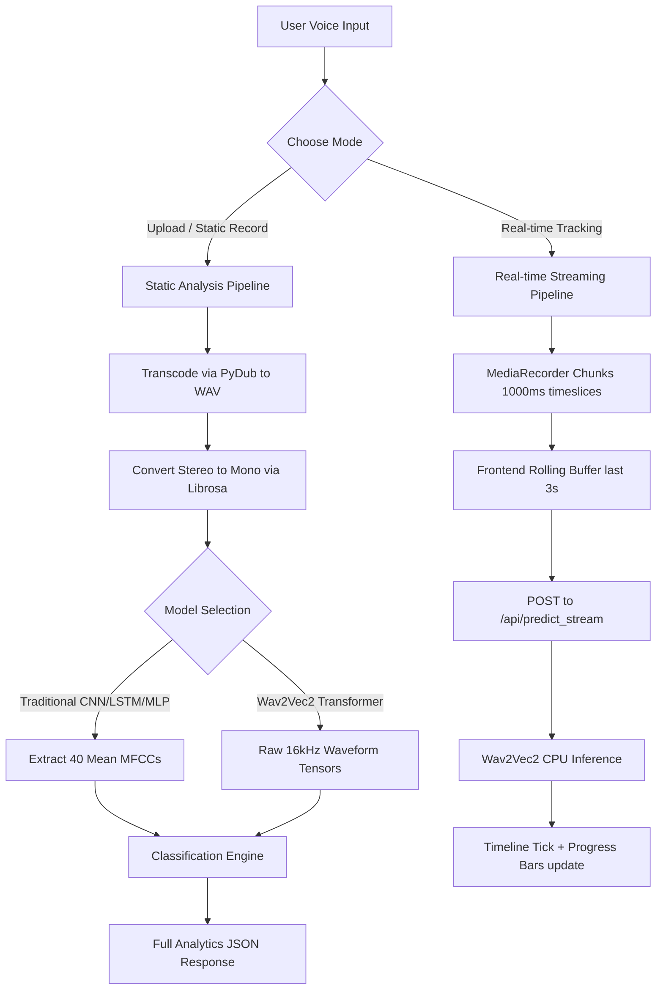
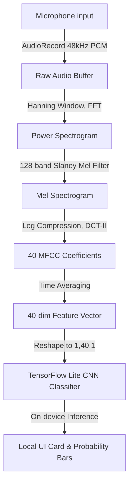

# 🎙️ VoxSense — Speech Emotion Recognition (SER) Suite

VoxSense is a modern, full-stack Speech Emotion Recognition system that decodes human emotions from voice inputs. By combining traditional Machine Learning, Deep Learning (CNN/LSTM), and state-of-the-art Transformers (Wav2Vec 2.0), VoxSense provides highly accurate static file analysis and low-latency, real-time emotional tracking.

---

## 📂 Codebase Structure

The project has been refactored into a structured, modular hierarchy:

```text
speech-emotion-recognition/
├── legacy/                   # Deprecated code and testing scripts
│   ├── another.py            # Legacy scikit-learn training script
│   ├── app.py                # Deprecated Streamlit frontend
│   └── ogg-2-wav.py          # Legacy Tkinter audio conversion utility
├── models/                   # Serialized neural networks & label encoders
│   ├── label_encoder.pkl                     # Maps emotion strings to target class IDs
│   ├── speech_emotion_recognition_cnn_model.h5  # Keras 1D CNN model weights
│   ├── speech_emotion_recognition_lstm_model.h5 # Keras LSTM model weights
│   └── speech_emotion_recognition_model.pkl     # Scikit-learn MLP classifier
├── notebooks/                # Jupyter notebook training pipelines
│   ├── another.ipynb         # MLP model training experiments
│   └── main.ipynb            # CNN and LSTM training notebook
├── static/                   # Frontend SPA (Single Page Application)
│   ├── app.js                # Core frontend engine (microphone, Canvas rendering, API polling)
│   ├── index.html            # Webpage layout (glassmorphism dashboard)
│   └── style.css             # Styling rules, design tokens, and keyframe animations
├── Dockerfile                # Encapsulates dependencies (FFmpeg, Libsndfile) for containerization
├── docker-compose.yml        # Local container orchestration
├── server.py                 # Flask REST API and static asset host
├── requirements.txt          # Python packages (TensorFlow, PyTorch, Transformers, Librosa)
└── README.md                 # Project handbook
```

---

## ⚙️ How It Works: The Core Processes

VoxSense operates two separate audio processing pipelines depending on the selected analysis mode: **Static Analysis** or **Real-Time Live Tracking**.



### 1. The Static Analysis Pipeline (File Upload & Normal Recording)
When a user uploads an audio file (`.wav`, `.mp3`, `.ogg`, `.flac`) or records a standard voice note, the following process occurs:

1. **Upload & Save**: The audio file is uploaded to the Flask backend as multipart form-data. The server writes it to a temporary directory.
2. **Audio Transcoding**: The backend uses `pydub` (powered by system `ffmpeg`) to check the audio extension. Any non-WAV formats are automatically transcoded to a standard WAV format.
3. **Stereo-to-Mono Alignment**: Traditional feature extraction algorithms fail on stereo (2-channel) inputs. The server checks the shape of the audio and converts multi-channel audio to mono using `librosa.to_mono()`.
4. **Feature Extraction vs. Raw Waveform Processing**:
   - **LSTM, CNN, and MLP Models**: The server loads the audio and extracts Mel-Frequency Cepstral Coefficients (MFCCs). It computes **40 MFCCs** for each frame and averages them over time (`np.mean(mfccs.T, axis=0)`), resulting in a single 40-dimensional feature vector.
   - **Wav2Vec2 Model**: Raw audio files are passed directly to the Hugging Face pipeline. The model internally resamples the audio to **16kHz** and processes the raw waveform values directly through its multi-head self-attention blocks.
5. **Inference**:
   - For TensorFlow models (LSTM/CNN), the input vector is reshaped to `(1, 40, 1)` and fed into the network.
   - For Scikit-learn models (MLP), the input vector is reshaped to `(1, 40)` and fed into `predict_proba()`.
   - For Wav2Vec2, the pipeline returns probability confidence scores for all classes.
6. **Visualization Generation**: The backend downsamples the audio waveform to exactly **500 points** using `librosa.load(sr=2000)` and normalizes the values between `-1.0` and `1.0` for frontend canvas rendering.
7. **Frontend Render**: The frontend receives the JSON response and:
   - Renders the downsampled waveform on an HTML5 canvas using color codes matching the dominant emotion.
   - Dynamically updates the horizontal probability progress bars with staggered transition animations.
   - Appends the run to the session history drawer (cached in `localStorage`).

---

### 2. The Real-Time Live Tracking Pipeline
When the user toggles **"Real-time Live Tracking"** and clicks "Start Recording":

1. **Browser Audio Capturing**: The frontend uses `navigator.mediaDevices.getUserMedia` to access the microphone and spawns a `MediaRecorder` instance.
2. **Timesliced Recording**: Instead of waiting for the user to finish speaking, `mediaRecorder.start(1000)` is called, which fires the `ondataavailable` event every **1,000 milliseconds**.
3. **Sliding Window Buffer**: The frontend JavaScript maintains a rolling queue (`liveChunks`). Every second, the new chunk is appended to the queue, and if the queue exceeds **3 chunks (3 seconds)**, the oldest chunk is shifted out. This creates a sliding 3-second evaluation window.
4. **Sub-second Polling**: The rolling chunks are combined into a single WebM/OGG blob and sent to the `/api/predict_stream` endpoint via a `POST` request.
5. **Low-latency Backend Inference**: The backend processes the short 3-second chunk and returns a lightweight prediction payload containing only the probabilities (avoiding the CPU overhead of generating waveform visualizations for every sub-second tick).
6. **Live Emotional Timeline Chart**: The frontend receives the prediction and plots a vertical segment (tick) on the **Real-time Emotion Timeline**:
   - The tick color corresponds to the dominant emotion (e.g., Crimson for Angry, Amber for Happy).
   - The height of the tick scales according to the confidence score.
   - Hovering over a tick shows a tooltip with the emotion name, probability, and precise timestamp.
   - The chart auto-scrolls to the right to display a scrolling timeline of your voice dynamics.
7. **Full Saving**: Simultaneously, all raw chunks are saved in a separate background array so that when the user clicks "Stop Session", they can still preview, play back, or analyze the full recording.

---

## 🧠 Model Architectures

VoxSense includes four distinct models to evaluate accuracy and inference speeds:

| Model Architecture | Input Format | Features Analyzed | Description | Accuracy |
|---|---|---|---|---|
| **Wav2Vec 2.0 (Transformer)** | Raw Waveform | Semantic Context & Raw Audio Tensors | Fine-tuned XLSR model (`harshit345/xlsr-wav2vec-speech-emotion-recognition`). Uses self-attention layers to capture language context and speech nuances. | **Highest (State-of-the-Art)** |
| **LSTM (Recurrent)** | 40-dim MFCC Vector | Temporal Auditory Patterns | Two LSTM layers followed by dense dropout. Captures how speech features change over time. | **Moderate-High** |
| **CNN (1D Convolutional)** | 40-dim MFCC Vector | Spatial Acoustic Features | 1D convolutions followed by pooling. Good at detecting patterns like pitch and timbre. | **Moderate** |
| **MLP (Classifier)** | 40-dim MFCC Vector | Flat Acoustic Features | Multi-Layer Perceptron trained in scikit-learn. Fast baseline. | **Baseline** |

---

## 🚀 Getting Started

### Prerequisites
You must have `ffmpeg` installed on your machine to handle audio format transcoding.
- **Ubuntu/Debian**: `sudo apt-get install ffmpeg libsndfile1`
- **macOS**: `brew install ffmpeg`

---

### Run Locally (Python 3.12)

1. **Create and Activate Environment** (using `uv` or `venv`):
   ```bash
   uv venv --python 3.12
   source .venv/bin/activate
   ```
2. **Install Dependencies**:
   ```bash
   uv pip install -r requirements.txt
   ```
3. **Run Server**:
   ```bash
   python server.py
   ```
4. **Access Web App**: Open `http://localhost:5000` in your web browser.

---

### Run with Docker

Docker simplifies environment setup by automatically encapsulating system packages like FFmpeg and Libsndfile.

1. **Build and Start Container**:
   ```bash
   docker-compose up --build
   ```
2. **Access Web App**: Open `http://localhost:5000` in your web browser.

---

## 📱 Local Android Application (VoxSense)

> [!TIP]
> **Direct Download**: Get the pre-built application binary directly: **[voxsense-v1.0.1.apk](voxsense-v1.0.1.apk)**. Copy it to your Android device to install and use it immediately without setting up compiler tools.

VoxSense includes a fully local Android application in the `android-app/` directory. It implements Speech Emotion Recognition entirely on-device, requiring **no internet connection or external server requests**.

### How It Works (Android Pipeline)



1. **Mic Capture**: Records raw 16-bit mono PCM audio at **48,000 Hz** (to match the native sample rate of the RAVDESS training set) using the standard Android `AudioRecord` API.
2. **On-Device Feature Extraction**:
   - Breaks audio into overlapping frames with a periodic Hanning window (frame size `2048`, hop size `512`).
   - A custom Kotlin `MfccExtractor` calculates the power spectrum via an in-place Cooley-Tukey Radix-2 FFT.
   - It computes the energy in **128 Mel bands** using a Slaney-normalized Mel scale filterbank.
   - Log-compression is applied to convert the energy to decibels.
   - An orthogonal Discrete Cosine Transform (DCT-II) is computed to extract **40 MFCCs** per frame, which are then averaged over the entire recording duration to yield a single 40-dimensional feature vector.
3. **On-Device Inference**:
   - The feature vector is formatted into a `[1, 40, 1]` tensor.
   - The TensorFlow Lite interpreter runs `speech_emotion_recognition_cnn_model.tflite` to predict emotion probabilities.
   - Class indices correspond to the alphabetical sorted labels: `['angry', 'calm', 'disgust', 'fearful', 'happy', 'neutral', 'sad', 'surprised']`.
4. **Jetpack Compose UI**: Styled with modern **Material 3 (M3) dynamic color theming** (automatically adapting to system light/dark mode and Android 12+ wallpaper colors, mapping to custom paralinguistic color palettes for visual emotion feedback). It features a fullscreen loading dialog during voice processing, an animated waveform visualizer modulated by live microphone amplitude, and color-coded progress bars.
5. **Acoustic & UI Customizations (Multiple Options)**:
   - **Pre-emphasis Filter**: Boosts high-frequency bands ($y[n] = x[n] - 0.97 \cdot x[n-1]$) to highlight vocal formants.
   - **Noise Gate**: Attenuates background noise and hum below an amplitude threshold of $0.015$.
   - **Timed Limits**: Configurable recording timers (Manual Stop, 3s, 5s, or 10s) with automated inference execution.
   - **Tracked Emotions Checklist (Multi-Select)**: A checklist allowing users to selectively filter which emotion progress bars are rendered on the results card.
   - **Dynamic Model Manager**: Enables dynamic model downloads (TFLite files) directly within the application, allowing users to toggle and activate their preferred model (CNN, LSTM, CRNN). It supports a high-speed local development connection over USB by running `adb reverse tcp:5000 tcp:5000` to fetch models directly from the workspace Flask server, and automatically falls back to raw GitHub URLs if the local developer server is unreachable.

### Build and Run Android App

1. **Prerequisites**: Ensure you have Android SDK/NDK path configured (typically in `android-app/local.properties` as `sdk.dir=/path/to/Android/Sdk`).
2. **Build debug APK**:
   ```bash
   cd android-app
   ./gradlew assembleDebug
   ```
3. **Deploy to Device**:
   Ensure your Android device or emulator is connected via ADB, then run:
   ```bash
   ./gradlew installDebug
   ```

---

## 🔌 API Reference

### 1. Health Status
Check backend connectivity and verify which models loaded successfully.
- **Route**: `GET /api/health`
- **Response**:
  ```json
  {
    "status": "ok",
    "models_loaded": ["lstm", "cnn", "mlp", "wav2vec2"],
    "label_encoder_loaded": true
  }
  ```

### 2. Predict Speech Emotion
Performs standard emotion classification on static files.
- **Route**: `POST /api/predict`
- **Payload**: Multipart Form-data
  - `file`: Audio file (`.wav`, `.mp3`, `.ogg`, `.flac`)
  - `model`: Model name string (`"wav2vec2"`, `"lstm"`, `"cnn"`, `"mlp"`). Defaults to `"wav2vec2"`.
- **Response**:
  ```json
  {
    "success": true,
    "emotion": "happy",
    "confidence": 0.942,
    "all_emotions": {
      "neutral": 0.012, "calm": 0.005, "happy": 0.942, "sad": 0.008,
      "angry": 0.011, "fearful": 0.006, "disgust": 0.004, "surprised": 0.012
    },
    "model_used": "wav2vec2",
    "waveform": [0.0, 0.12, -0.25, 0.35, ...]
  }
  ```

### 3. Predict Stream Chunk
Infers emotion from short rolling chunks (optimized for real-time streaming).
- **Route**: `POST /api/predict_stream`
- **Payload**: Multipart Form-data
  - `file`: Audio blob representing short recording segment
  - `model`: Model name string (`"wav2vec2"`, `"lstm"`, `"cnn"`, `"mlp"`)
- **Response**:
  ```json
  {
    "success": true,
    "emotion": "neutral",
    "confidence": 0.821,
    "all_emotions": {
      "neutral": 0.821, "calm": 0.082, "happy": 0.012, "sad": 0.034,
      "angry": 0.010, "fearful": 0.011, "disgust": 0.008, "surprised": 0.022
    },
    "model_used": "wav2vec2"
  }
  ```
